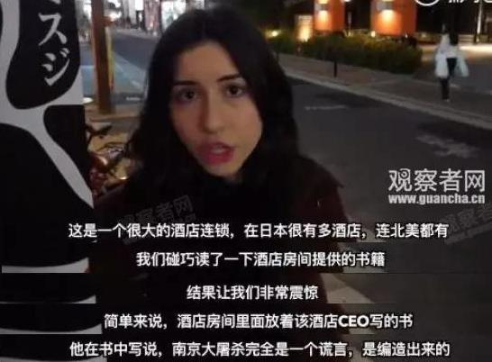

2017年1月，这家酒店被曝光在店内放置了“否认南京大屠杀”的书籍，里面写到：

> “南京事件之前，南京人口是20万，南京事件后一个月，南京人口为25万，所以在这一个月中，
>
> 30万人被杀害是绝对不成立的，他们都不存在，所以南京大屠杀和韩国慰安妇都是不存在的。”

面对中国民众的谴责，酒店董事长不仅没有道歉，还大言不惭地在记者会上叫嚣：“绝不撤书！”

这件事儿发生当下，APA酒店就遭到国内各大网站下架，旅游企业也终止了和APA酒店管理集团的一切合作，损失可谓惨重。

参考链接：

> https://baike.baidu.com/item/%E9%98%BF%E5%B8%95%E9%85%92%E5%BA%97/14960435?fromtitle=APA%20%E9%85%92%E5%BA%97&fromid=20428216&fr=aladdin

> https://www.zhihu.com/question/303356606/answer/1777583488